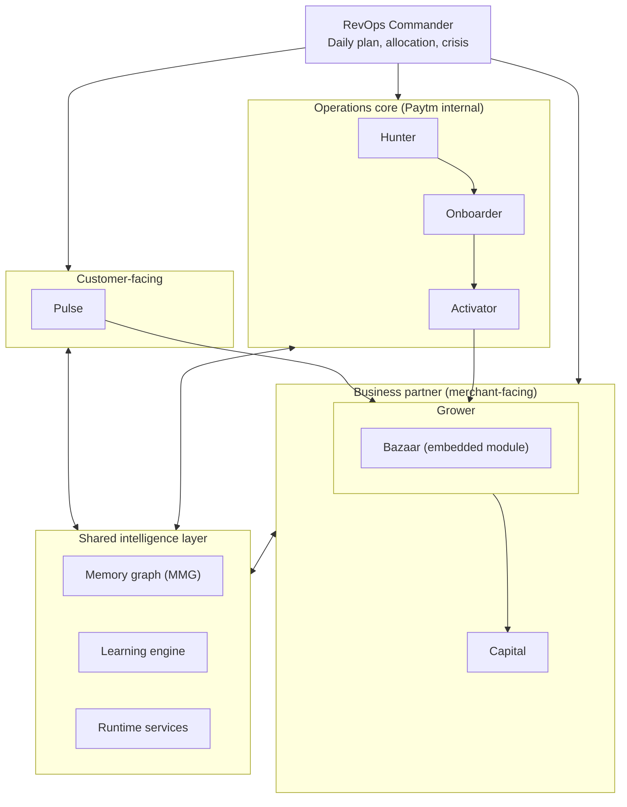
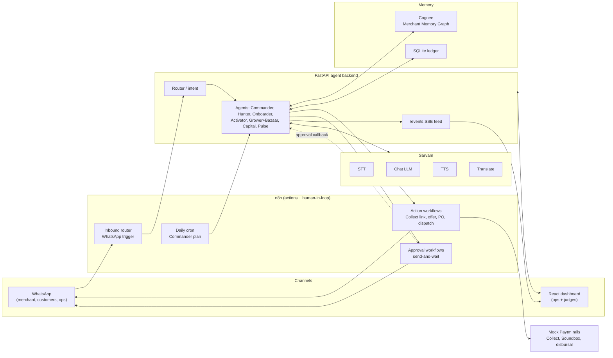

# Paytm Commerce OS: Project Context

> **Purpose of this file:** A single source of truth for the Paytm Commerce OS project (Paytm Build for India AI hackathon, Track 3: AI teammates that get the job done). It covers the problem, the proposed solution, the system architecture, the detailed working of every agent, the partner integrations (n8n, Sarvam, Cognee), the prototype tech stack, and the build plan.
>
> **Version:** v2 (2026-09-25). Adds sections 7–10 (partner integrations, prototype stack and architecture, prototype scope, build plan). The simple end-to-end walkthrough for the pitch deck lives in `workflow.md`.
>
> **Scope note:** The Guardian Agent is intentionally excluded from this architecture.
>
> **Convention:** Anything marked *(assumption)* is an interpretation added for clarity and was not stated explicitly in the original project description. Confirm or correct these before treating them as fact.

---

## 1. Problem statement

Small merchants in India (kiranas, local shops, service businesses) are expensive and slow for Paytm to acquire, activate and grow. Today:

- **Acquisition and onboarding are manual and fragmented.** Lead qualification, KYC, banking, hardware and legal steps run one after another and rely on humans, so merchants drop off along the way.
- **Activation stalls.** A merchant can receive a device and still never complete a first transaction.
- **Merchants run on instinct.** They struggle with udhaar (informal credit) recovery, stock-outs, festival and peak-hour planning, and cash-flow gaps. Formal credit rarely arrives at the moment they need it.
- **Customers are invisible to them.** Merchants cannot identify repeat customers, win back lapsed ones, or recover failed payments in the moment.
- **The environment is constrained.** Customer PII must be protected, merchants speak many languages, and connectivity is unreliable.

**Core problem:** There is no single, autonomous system that takes a merchant from lead to a growing, credit-backed business with minimal human effort while respecting privacy.

---

## 2. Proposed solution

**Paytm Commerce OS** is a multi-agent AI platform that runs the full merchant lifecycle: **find, onboard, activate, grow and fund**. It also adds a customer-facing layer that works on the merchant's behalf.

| Group | Agents | Role |
|---|---|---|
| Orchestrator | RevOps Commander | Daily planning, resource allocation, crisis coordination |
| Operations core (Paytm internal) | Hunter, Onboarder, Activator | Acquire, onboard and activate merchants |
| Business partner (merchant-facing) | Grower (with embedded Bazaar), Capital | Grow the merchant's business and fund it |
| Invisible salesperson (customer-facing) | Pulse | Serve and retain the merchant's customers |
| Shared intelligence layer | Memory graph, learning engine, runtime services | Common memory, models and execution for all agents |

**Design principles**

1. **Autonomy first, humans by exception.** Humans handle strategic decisions (Commander level) and the exceptions that agents cannot resolve (Onboarder escalation).
2. **Privacy by construction.** Zero-PII profiling, federated learning with encrypted deltas, and zero PII egress.
3. **Shared learning.** Every agent writes outcomes to one memory graph and reads policies learned from all merchants.
4. **Native to Paytm rails.** Soundbox, Collect, Settlements, UPI Intent, ONDC and the Field App are the execution channels.
5. **Works where merchants are.** Vernacular voice in 12 languages and on-device execution that runs offline in under 50MB.
6. **Acts, not just answers.** Every agent decision ends in a real action (a message, a payment link, an offer, a PO) executed through n8n, with humans pulled in only when a guardrail fires.

**Partner stack:** n8n (actions and human-in-the-loop), Sarvam (vernacular voice and Indic LLM), Cognee (Merchant Memory Graph). See section 7.

---

## 3. Architecture

### 3.1 System diagram



### 3.2 Layout summary

- **Top:** RevOps Commander.
- **Left cluster:** Operations core. Hunter, Onboarder and Activator run in sequence.
- **Middle cluster:** Business partner. Grower is the large container with Bazaar embedded inside it. Capital sits beside it as a separate agent.
- **Right cluster:** Customer-facing agent, Pulse.
- **Bottom band:** Shared intelligence layer spanning all agents. Every agent has a bidirectional connection to it.

### 3.3 Data flows

| # | From | To | Payload |
|---|---|---|---|
| 1 | Hunter | Onboarder | Qualified lead + context packet |
| 2 | Onboarder | Activator | KYC complete + hardware request |
| 3 | Activator | Grower | Activated merchant + first-transaction context |
| 4 | Grower | Bazaar | Demand forecast / stock gaps (internal, bidirectional) |
| 5 | Grower | Capital | Liquidity-gap signal / creditworthiness |
| 6 | Pulse, via MMG | Grower | Customer profiles, household graphs, LTV signals |
| 7 | All agents | MMG | Write: transactions, interactions, exceptions, decisions |
| 8 | Shared intelligence | All agents | Read: bandit policies, causal models, entity maps |
| 9 | Commander | All agents | Daily plan + resource allocation + crisis directives |
| 10 | All agents | Commander | Metrics, exception rates, portfolio state |

**Arrow conventions for diagrams:** solid for primary flows, dotted for async or event-driven flows, bidirectional for Grower and Bazaar.

---

## 4. Agent-by-agent working

### 4.1 RevOps Commander (orchestrator)

**Purpose:** The single coordinating brain above all agents. It decides where effort and budget go each day so the system as a whole hits its targets.

**Objectives it balances:** GMV, CAC, TTFT (time to first transaction, *(assumption)*), and Compliance.

**How it works**

1. **Daily multi-objective planning.** Each day it produces a plan that trades off the four objectives against each other, for example accepting slightly higher CAC to protect compliance or to speed up activation.
2. **Portfolio resource allocation.** It distributes scarce resources across merchants and agents: field agents, hardware inventory, and budget (incentives, credit exposure, outreach spend).
3. **Crisis coordination.** When something breaks (a spike in onboarding exceptions, a settlement issue, a hardware shortage), it issues crisis directives that override the normal daily plan.
4. **Human-in-the-loop for strategy only.** Routine allocation is autonomous. Humans are consulted only for strategic decisions.

**Inputs:** Metrics, exception rates and portfolio state from every agent.
**Outputs:** Daily plan, resource allocation and crisis directives to every agent.

---

### 4.2 Hunter (operations core)

**Purpose:** Find merchants worth onboarding and hand over only qualified leads.

**Workflow**

1. **Lead ingestion.** Pulls in leads from available sources.
2. **Zero-PII profiling.** Builds a merchant profile from non-personal signals, keeping personal data out of the qualification stage.
3. **Fit scoring.** Scores how well the merchant fits Paytm's offering and how likely they are to activate and stay active.
4. **Bandit outreach.** A contextual bandit chooses which channel, message and timing to use for each lead, learning from responses. Outreach is an exploration-versus-exploitation problem.
5. **Qualified handoff.** Passes the lead to Onboarder with a **context packet** so the next agent does not have to re-collect information.

**Output:** Qualified lead + context packet to Onboarder.
**Shared layer:** Uses bandit policies. Writes interactions and decisions to MMG.

---

### 4.3 Onboarder (operations core)

**Purpose:** Convert a qualified lead into a fully onboarded merchant as fast as possible, with minimal human effort.

**Workflow**

1. **Five parallel tracks** run at the same time instead of one after another:
   - **Doc track:** collects and validates merchant documents.
   - **Compliance track:** regulatory and KYC checks.
   - **Banking track:** bank account verification and settlement set-up.
   - **Hardware track:** determines and reserves the device the merchant needs.
   - **Legal track:** agreements and legal requirements.
2. **Exception Resolver.** When a track hits a problem (mismatched name, unreadable document, failed verification), a hybrid **LLM + rule** resolver attempts to fix it. **92% of exceptions are resolved automatically.**
3. **Human escalation.** The remaining exceptions go to a person, with the context already assembled.

**Output:** KYC complete + hardware request to Activator.
**Shared layer:** Uses the LLM+rule exception resolver and entity resolution. Writes exceptions and decisions to MMG. Exception rates go to the Commander.

---

### 4.4 Activator (operations core)

**Purpose:** Turn an onboarded merchant into an active one, meaning a merchant who completes real transactions.

**Workflow**

1. **Device allocation.** Assigns a device (for example a Soundbox) from inventory, guided by the Commander's hardware allocation.
2. **Logistics dispatch.** Ships the device.
3. **Field agent assignment.** Assigns a field agent (via the Field App) where in-person help is worth the cost, guided by the Commander's field-agent allocation.
4. **Real-time intervention.** Monitors progress and steps in when a merchant is stuck, for example a device not powered on or a QR not displayed. *(assumption on the specific triggers)*
5. **First transaction guarantee.** Drives the merchant to a first successful transaction rather than stopping at device delivery.
6. **Grower handoff.** Passes the activated merchant to Grower along with first-transaction context.

**Output:** Activated merchant + first-transaction context to Grower.
**Shared layer:** Writes transactions and interactions to MMG.

---

### 4.5 Grower (merchant-facing, primary agent)

**Purpose:** The merchant's ongoing business partner. It runs recurring loops that increase revenue and reduce operational pain. It is the largest agent and contains Bazaar as an embedded module.

**Core loops**

1. **Udhaar recovery.** Bandit-driven nudges to customers who owe the merchant money, with Paytm Collect links so they can pay instantly.
2. **Customer win-back.** Predicts which customers are about to churn and runs campaigns to bring them back.
3. **Peak-hour prep and festival planning.** Anticipates busy periods and festivals so the merchant is staffed, stocked and ready.
4. **Loyalty and referral viral loops.** Runs loyalty programs and referrals that turn customers into a growth channel.
5. **Weekly vernacular voice brief.** A short spoken summary (about 90 seconds) in the merchant's own language, from a set of 12 languages, covering what happened and what to do next.

**Inputs:** Activated-merchant context from Activator. Customer profiles, household graphs and LTV signals from Pulse via MMG.
**Outputs:** Liquidity-gap and creditworthiness signals to Capital. Demand forecasts and stock-gap requests to Bazaar.
**Shared layer:** Contextual bandits (per merchant), causal inference to measure whether campaigns worked, vernacular voice.

---

### 4.6 Bazaar (embedded module inside Grower)

**Purpose:** Solve the merchant's supply side, meaning what to stock, from whom, and at what price and credit terms. Bazaar is not a standalone agent. It is a module inside Grower and exchanges forecasts and stock gaps with Grower bidirectionally.

**Workflow**

1. **Demand forecast.** Predicts what the merchant will need, using Grower's signals and POS data.
2. **Multi-supplier negotiation.** Negotiates with several suppliers **in parallel** over WhatsApp, APIs or ONDC.
3. **MILP allocation.** A mixed-integer linear program picks the best allocation across suppliers, optimizing **price, credit terms and delivery speed** together.
4. **Auto-PO and Paytm Collect advance.** Raises the purchase order automatically and can advance payment through Paytm Collect.
5. **GRN tracking and 3-way match, then auto-payment.** Tracks goods receipt (GRN) and matches purchase order, receipt and invoice. When they agree, payment is released automatically.

**Shared layer:** Uses ONDC and Paytm rails for supplier connectivity and payment. Writes decisions to MMG.

---

### 4.7 Capital (merchant-facing)

**Purpose:** Turn the merchant's business data into timely credit and manage the loan with minimal human involvement.

**Workflow**

1. **Continuous underwriting.** Creditworthiness is assessed on an ongoing basis from transaction and behavior data in MMG, not at a single application moment.
2. **Proactive offers.** Offers are pushed when a need is detected (triggered by Grower's liquidity-gap signal), so the merchant does not have to apply.
3. **One-tap acceptance.** The merchant accepts in a single action.
4. **Instant disbursal.** Funds are paid out immediately.
5. **Daily percentage repayment.** Repayment is a small share of daily sales, so it tracks business performance instead of a fixed monthly instalment.
6. **Limit auto-increase.** Good repayment behavior raises the credit limit automatically.
7. **Insurance cross-sell.** Insurance is offered as an extension once the credit relationship is established.

**Inputs:** Liquidity-gap signal and creditworthiness from Grower.
**Shared layer:** Reads bandit policies and causal models to choose and evaluate offers. Writes offers, acceptances and repayments to MMG. Reports portfolio state to the Commander.

**Open point:** Risk limits, default handling and regulatory controls are not defined in this document (Guardian is excluded). Ownership of those controls should be stated explicitly.

---

### 4.8 Pulse (customer-facing: "the invisible salesperson")

**Purpose:** Serve the merchant's *customers* directly and quietly, so the merchant gains repeat business without doing extra work. It runs largely on-device and feeds insight back to Grower.

**Capabilities**

1. **Identity resolution.** Recognizes the same customer across signals: UPI, device, behavior and co-occurrence patterns.
2. **Per-customer contextual bandit.** Chooses the best action for each individual customer from: cashback, loyalty, win-back, cross-sell, referral, feedback request, and payment recovery.
3. **Household graph clustering.** Groups related customers into households so offers and messages are coordinated instead of duplicated.
4. **Real-time payment failure recovery.** Recovers a failed payment in **under 3 seconds** across **4 channels** *(the channels are not named in the source)*.
5. **On-device NLU concierge.** A natural-language assistant running on the device that handles stock enquiries, udhaar, pre-orders, bookings and complaints.

**Outputs:** Customer profiles, household graphs and LTV signals to Grower via MMG.
**Shared layer:** Entity resolution (FAISS + GNN), per-customer bandits, on-device execution (ONNX Runtime Mobile and ExecuTorch, under 50MB, offline-capable). Writes interactions and transactions to MMG.

---

## 5. Shared intelligence layer

A dashed horizontal band beneath all agents. Every agent **writes** outcomes to it and **reads** learned policies from it.

### 5.1 Memory graph (MMG)

The **Merchant Memory Graph** is the system's long-term memory, implemented with **Cognee** (see 8.7). It is **versioned with time-travel**, so any past state can be reconstructed, and it holds **customer sub-graphs** per merchant. It is the join point between Pulse's customer insight and Grower's decisions.

### 5.2 Learning engine

| Component | What it does |
|---|---|
| **Contextual bandits** (LinUCB / Thompson) | Per-merchant and per-customer decision policies (outreach, offers, nudges) |
| **Causal inference** (DoWhy / EconML) | Counterfactual attribution: did the action actually cause the outcome? |
| **Multi-agent RL** (QMIX / VDN) | Coordinates agents toward shared goals, trained on 10K synthetic merchant lifecycles |
| **Federated learning** (Flower) | Models improve from all merchants via encrypted deltas, with **zero PII egress** |

### 5.3 Runtime services

| Component | What it does |
|---|---|
| **Entity resolution** (FAISS + GNN) | Fuzzy-matches identities across 12 sources |
| **LLM + rule hybrid exception resolver** | Auto-resolves 92% of exceptions (used by Onboarder) |
| **On-device execution** (ONNX Runtime Mobile + ExecuTorch) | Models under 50MB running offline on the device |
| **Vernacular voice** (Sarvam: STT, TTS, translation) | 12 languages, 90-second spoken brief |
| **Indic LLM** (Sarvam chat model) | Intent parsing, exception resolver, concierge, message copy |
| **Action and approval layer** (n8n) | Webhook actions, cron, WhatsApp channel, human-in-the-loop approvals |
| **Paytm rail native** | Soundbox, Collect, Settlements, UPI Intent, ONDC, Field App as execution channels (mocked in the prototype, invoked via n8n) |

---

## 6. End-to-end lifecycle (one merchant's journey)

1. **Hunter** ingests a lead, profiles it without PII, scores fit, and runs bandit outreach until the lead qualifies.
2. **Onboarder** runs the five tracks in parallel. Exceptions are auto-resolved (92%) or escalated to a human.
3. **Activator** allocates and ships a device, assigns a field agent if needed, intervenes in real time, and guarantees a first transaction.
4. **Grower** takes over: recovers udhaar, wins back churning customers, prepares for peaks and festivals, runs loyalty and referrals, and delivers a weekly voice brief.
5. **Bazaar** (inside Grower) forecasts demand, negotiates with suppliers, raises purchase orders and pays on a 3-way match.
6. **Capital** underwrites continuously and proactively offers credit when Grower signals a liquidity gap, then manages repayment, limit increases and insurance.
7. **Pulse** works throughout, resolving customer identities, running per-customer offers, recovering failed payments and answering customer queries on-device.
8. **RevOps Commander** watches the whole portfolio daily and reallocates field agents, hardware and budget.
9. **Shared intelligence layer** captures every outcome so the next merchant is served better than the last.

---

## 7. Partner integrations (n8n, Sarvam, Cognee)

The hackathon partners map onto CommerceOS as follows. This replaces earlier placeholder choices (Krutrim/Bhashini for voice, a custom MMG store, custom action connectors).

### 7.1 Mapping at a glance

| CommerceOS component | Partner | Role in the system |
|---|---|---|
| Merchant Memory Graph (MMG) | **Cognee** | Shared long-term memory for all agents. Agents write outcomes with `add` + `cognify` and read context with graph/vector `search`. |
| Pulse identity resolution + household graph | **Cognee** | Customer → household → merchant relationships stored as graph edges (replaces FAISS + GNN for the prototype). |
| Vernacular voice (weekly brief, merchant voice notes) | **Sarvam** | Speech-to-text (Saarika) for voice notes, text-to-speech (Bulbul) for the 90-second brief, translation (Mayura / Sarvam Translate) for outbound messages. |
| Agent reasoning (intent parsing, exception resolver, concierge, nudge copy) | **Sarvam** | Sarvam chat LLM for Indic and Hinglish reasoning and replies. The LLM half of the "LLM + rule" resolver. |
| Actions across systems (Collect links, loan offers, POs, field tasks) | **n8n** | Every agent action is an n8n workflow called through a webhook. This is the "takes actions, not just responds" layer. |
| Human escalation (Onboarder exceptions, Capital approvals) | **n8n** | n8n send-and-wait / Wait nodes pause the flow until a human approves on WhatsApp (reply buttons), then resume. |
| RevOps Commander daily plan | **n8n** (cron) + **Cognee** | Daily scheduled workflow reads portfolio state from Cognee, calls the Commander to build the plan, and publishes it. |
| Bazaar supplier negotiation (stretch) | **n8n** + **Sarvam** | Parallel supplier messages fanned out from n8n. Replies are parsed by the Sarvam LLM and scored with a simple rule (MILP is roadmap). |
| Customer and merchant channel | **n8n** (WhatsApp Trigger + WhatsApp Business Cloud node) | WhatsApp is the only channel for merchants, customers and ops approvers, because that's where Indian merchants already are. The prototype uses the Meta WhatsApp Cloud API test number (see 8.9). |

### 7.2 Per-agent partner usage

| Agent | n8n | Sarvam | Cognee |
|---|---|---|---|
| RevOps Commander | Daily cron, crisis alerts | Plan summary in merchant/ops language | Reads portfolio state, writes plans |
| Hunter | Outreach sends | Vernacular outreach copy | Writes leads and responses |
| Onboarder | Human-escalation approval flow | LLM exception resolver | Writes exceptions and resolutions |
| Activator | Dispatch / field-agent task | Setup guidance messages | Writes activation events |
| Grower | Collect-link nudges, campaigns | STT of voice notes, TTS weekly brief, nudge copy | Reads customers, udhaar, sales; writes decisions |
| Bazaar (in Grower) | Supplier fan-out, auto-PO | Parse supplier replies | Reads demand, writes POs |
| Capital | Offer push, human-approval above threshold | Offer explanation in vernacular | Reads transaction history, writes offers and repayments |
| Pulse | WhatsApp inbound and replies | Hinglish NLU concierge | Customer and household graph, stock lookup, interaction log |

### 7.3 Cost and free-tier notes (as of September 2026)

| Partner | Free option | Notes |
|---|---|---|
| n8n | Self-hosted Community edition is free (no license key). Cloud has a free trial. | Community lacks SSO, sharing and environments, none of which the prototype needs. |
| Sarvam | ₹100 free credits per account at signup, usable across APIs, no expiry. | Approx. rates: STT ₹30/hour, TTS ₹30 per 10k characters, translation ₹20 per 10k characters, 105B LLM ₹29.28 / ₹73.2 per 1M input/output tokens. Entry tier rate limits (e.g. about 60 req/min STT). One account per teammate is recommended. |
| Cognee | Open source is free forever. Cognee Cloud free plan includes 1M tokens, no card. | Open source needs an LLM + embedding provider (defaults to OpenAI). Either use Cognee Cloud free plan or point it at a free LLM (Gemini free tier / local Ollama) with local embeddings. Keep seed data small because `cognify` consumes tokens. |

---

## 8. Prototype tech stack and architecture

### 8.1 Stack

| Layer | Choice | Why |
|---|---|---|
| Agent backend | Python + FastAPI, one module per agent, plain function-calling router (no heavy agent framework) | Fast to build; Cognee is Python-native |
| LLM | Sarvam chat model (confirm current model name on the Sarvam dashboard) | Indic + Hinglish reasoning, partner integration |
| Voice | Sarvam STT (Saarika) and TTS (Bulbul) | 12-language vernacular promise |
| Memory | Cognee (Cloud free plan or local) | Merchant Memory Graph |
| System of record | SQLite (ledger for transactions, udhaar balances, loans, stock) | Exact numbers must not depend on LLM extraction; Cognee holds relationships and semantic context, SQLite holds the money |
| Actions + human-in-the-loop | n8n (Docker self-hosted or Cloud trial) | Webhooks, cron, WhatsApp, send-and-wait approvals |
| Channel | WhatsApp via Meta WhatsApp Cloud API (n8n WhatsApp Trigger + WhatsApp Business Cloud node) | Merchants and customers already live on WhatsApp; supports text, voice notes and interactive buttons |
| Frontend | React (Vite or Next.js) dashboard | Activity feed, merchant view, approvals queue, Commander KPIs |
| Live updates | Server-Sent Events from FastAPI (`/events`) | Judges see every agent decision and action in real time |
| Paytm rails | Mocked (Collect link, Soundbox, settlements, disbursal) | No sandbox access; mocks return realistic payloads |

### 8.2 Prototype architecture diagram



### 8.3 Request lifecycle (standard pattern for every agent action)

1. **Trigger** arrives: WhatsApp message/voice note (via n8n inbound), dashboard click, or n8n cron.
2. **Understand**: voice → Sarvam STT → text → Sarvam LLM intent + entity extraction.
3. **Recall**: agent queries Cognee for context (customer history, household, past decisions) and SQLite for exact figures.
4. **Decide**: rules + LLM choose the action. Guardrails check thresholds and confidence.
5. **Act**: agent calls the matching n8n webhook. If a guardrail fires, the call goes to an approval workflow instead.
6. **Record**: outcome written to SQLite (numbers) and Cognee (context and decision), and emitted on `/events`.
7. **Report**: metrics roll up to the Commander view.

### 8.4 Guardrails and escalation rules (proposed defaults, tune as needed)

| Rule | Default | Owner |
|---|---|---|
| Capital offer needs human approval | Offer amount above ₹25,000 or merchant risk flag | n8n approval workflow |
| Onboarder exception escalates | Resolver confidence below 0.7 or rule conflict | n8n approval workflow |
| Udhaar nudge frequency cap | Max 1 nudge per customer per 3 days | Grower rule |
| Agent conflict (e.g. Capital lend vs Grower churn risk) | Commander reads both signals from Cognee; risk flag blocks auto-offer and routes to human | Commander |

These answer, for the prototype, the open questions on Capital risk ownership and inter-agent conflicts (see section 12).

### 8.5 n8n workflows

| ID | Name | Trigger | Steps | Returns |
|---|---|---|---|---|
| WF1 | `whatsapp-inbound` | WhatsApp Trigger | If voice note → download media → POST `/ingest/voice`; if text → POST `/ingest/text`; if button reply → POST `/callbacks/n8n`; send agent reply back on WhatsApp | Reply message |
| WF2 | `udhaar-nudge` | Webhook | Build mock Collect link → WhatsApp message to customer in their language | Delivery status |
| WF3 | `capital-offer` | Webhook | IF amount > threshold → send-and-wait approval to ops → on approve, send one-tap offer to merchant → callback `/callbacks/n8n` | Offer status |
| WF4 | `onboarding-escalation` | Webhook | Send exception packet to human → wait for decision → callback | Human decision |
| WF5 | `commander-daily-plan` | Cron (daily) + manual | POST `/commander/plan` → post plan to dashboard and ops WhatsApp | Plan |
| WF6 | `bazaar-po` (stretch) | Webhook | Fan-out supplier messages → collect replies → POST `/bazaar/score` → send PO | PO |

### 8.6 Backend API (FastAPI)

| Method | Path | Purpose |
|---|---|---|
| POST | `/ingest/voice` | Audio in → Sarvam STT → route to agent |
| POST | `/ingest/text` | Text in → route to agent |
| POST | `/grower/run` | Run Grower loops for a merchant (udhaar, win-back, peak prep) |
| GET | `/grower/brief/{merchant_id}` | Generate weekly brief text + Sarvam TTS audio |
| POST | `/capital/evaluate` | Underwrite from ledger + Cognee, create offer |
| POST | `/pulse/chat` | Customer concierge (stock, udhaar, pre-order) |
| POST | `/onboarder/exception` | Resolve or escalate an onboarding exception |
| POST | `/commander/plan` | Build daily plan from portfolio state |
| POST | `/callbacks/n8n` | Receive action results and approvals from n8n |
| GET | `/events` | SSE activity feed for the dashboard |

### 8.7 Cognee memory model

- **Dataset per merchant:** `merchant_<id>`; plus a shared `portfolio` dataset for Commander.
- **Entities:** Merchant, Customer, Household, Transaction (summary), UdhaarEntry, Product/Stock, Supplier, Offer, Decision, Exception, Interaction.
- **Key relationships:** Customer BELONGS_TO Household; Customer OWES Merchant (udhaar); Customer BOUGHT Product; Merchant RECEIVED Offer; Agent MADE Decision ABOUT Entity; Exception RESOLVED_BY Agent/Human.
- **Write pattern:** after every decision, agent writes a short natural-language event ("Grower sent udhaar nudge to Sharma ji for ₹1,200 on 2026-10-20, tone: polite") with `cognee.add(..., dataset_name=...)`, batch `cognify` at intervals, not per message, to save tokens.
- **Read pattern:** `cognee.search(query_type=GRAPH_COMPLETION, ...)` for context questions ("Which customers of Ramesh are lapsing and belong to the same household?"). Exact balances always come from SQLite.

### 8.8 Proposed repo layout

```
commerceos/
  backend/
    main.py              # FastAPI app, routes, SSE
    router.py            # intent → agent
    agents/              # commander.py hunter.py onboarder.py activator.py grower.py bazaar.py capital.py pulse.py
    services/            # sarvam.py cognee_mem.py n8n.py ledger.py (SQLite) mock_rails.py
    seed/                # seed_data.json, seed.py (loads SQLite + Cognee)
  n8n/                   # exported workflow JSONs WF1–WF6
  frontend/              # React dashboard
  demo/                  # cached TTS audio, sample voice notes, backup demo video
  .env.example           # SARVAM_API_KEY, COGNEE_API_KEY / LLM_API_KEY, N8N_BASE_URL, WHATSAPP_ACCESS_TOKEN, WHATSAPP_PHONE_NUMBER_ID, WHATSAPP_VERIFY_TOKEN
```


### 8.9 WhatsApp setup (prototype)

- **API:** Meta WhatsApp Cloud API, connected through n8n's WhatsApp Trigger (inbound) and WhatsApp Business Cloud node (outbound, including send-and-wait approvals with reply buttons).
- **Test number:** Meta provides a free test business number, with no business verification needed. It can message only a small set of pre-verified recipient numbers (about 5), so register the demo phones in advance: Ramesh (merchant), Sharma ji (customer), a Pulse customer, and the ops approver.
- **24-hour window:** free-form messages are only allowed within 24 hours of the user's last message. Before the demo, have every demo phone send "hi" to the bot to open the window. Outside the window, pre-approved template messages are required.
- **Webhook:** n8n needs a public HTTPS URL for Meta's webhook (n8n Cloud trial, or self-hosted behind ngrok / Cloudflare Tunnel).
- **Voice notes:** inbound audio comes as a media ID. Fetch it through the Graph API, then pass the file to Sarvam STT. Outbound TTS audio is uploaded as media and sent as an audio message.
- **Production:** verified WhatsApp Business account, approved message templates, and Paytm's own business number.

---

## 9. Prototype scope (hackathon build)

### 9.1 What is built vs mocked vs roadmap

| Area | Status in prototype |
|---|---|
| Grower: udhaar recovery, weekly voice brief | **Built (hero flow)** |
| Capital: liquidity-gap offer with human approval | **Built (hero flow)** |
| Pulse: Hinglish concierge on WhatsApp | **Built (light)** |
| Onboarder: one auto-resolved + one escalated exception | **Built (if time)** |
| Commander: daily plan + KPI panel | **Built (thin)** |
| Hunter, Activator | UI + seeded data, one action each |
| Bazaar | Stretch (WF6) |
| Paytm rails | Mocked |
| Contextual bandits, causal inference | Replaced by rules; roadmap |
| MARL, federated learning, on-device ONNX/ExecuTorch, FAISS+GNN, MILP, 3-way match | Roadmap slide only |

### 9.2 Hero demo script (the flow judges see)

Merchant persona: **Ramesh**, kirana owner, post-activation, speaks Hindi.

1. Ramesh sends a Hindi voice note on WhatsApp: "Sharma ji ka 1200 udhaar pending hai, aur Diwali ka stock kam hai."
2. Sarvam STT → text; Sarvam LLM extracts two intents: udhaar recovery (Sharma ji, ₹1,200) and stock/liquidity concern (Diwali).
3. **Grower** pulls Sharma ji's history from Cognee (regular customer, same household as another customer, pays late but pays) and the exact balance from SQLite, picks a polite tone, and calls n8n WF2. Sharma ji gets a Hindi message with a mock Collect link.
4. **Grower** detects a pre-Diwali cash gap and signals **Capital**. Capital underwrites from 90 days of ledger data and proposes an offer. Above the threshold, n8n WF3 sends it to an ops human for approval; once approved, Ramesh receives a one-tap offer.
5. **Pulse**: a customer asks the bot "atta hai kya?" in Hinglish; the concierge answers from stock data and logs the interaction in Cognee.
6. **Weekly brief**: Sarvam TTS plays a Hindi summary of the week and next actions.
7. Dashboard shows every step live (decision → n8n action → Cognee write) and Commander KPIs update.

### 9.3 Seed data

1 merchant (Ramesh), about 30 customers across about 10 households, 90 days of transactions, about 8 open udhaar entries, about 25 SKUs with stock levels, 3 suppliers. Synthetic, generated by `seed/seed.py`.

---

## 10. Build plan (5 hours)

Assumes a team of 3–4. *(assumption)*

| Time | A: agents/backend | B: Cognee + data | C: n8n + Sarvam | D: frontend + pitch |
|---|---|---|---|---|
| 0:00–0:30 | Repo, FastAPI skeleton, env keys | Seed data script | n8n up (public HTTPS URL), Sarvam keys tested, WhatsApp Cloud API app + test number set up, demo phones added as recipients | Dashboard scaffold |
| 0:30–2:30 | Grower + Capital logic, intent parsing | Load seed into SQLite + Cognee, query helpers | WF1–WF5, voice in/out | Activity feed, merchant view, approvals UI |
| 2:30–3:30 | Pulse concierge, Onboarder exception | Agent write-back to Cognee | WhatsApp end-to-end | Wire to backend APIs + SSE |
| 3:30–4:15 | Integration: run the hero flow end-to-end, fix breakages (all) | | | |
| 4:15–5:00 | Code freeze, record backup demo video, rehearse pitch (all) | | | Architecture + partner slide |

**Rules of thumb:** hardcode anything not on the demo path; cache TTS audio and replay it; show logs for every action; record a backup video before the pitch.

---

## 11. Glossary

| Term | Meaning |
|---|---|
| **Udhaar** | Informal credit a merchant extends to customers |
| **GMV** | Gross merchandise value |
| **CAC** | Customer acquisition cost |
| **TTFT** | Time to first transaction *(assumption)* |
| **PII** | Personally identifiable information |
| **KYC** | Know Your Customer verification |
| **ONDC** | Open Network for Digital Commerce |
| **Paytm Collect** | Paytm's payment-request and collection rail |
| **MILP** | Mixed-integer linear programming |
| **GRN** | Goods received note |
| **3-way match** | Reconciling purchase order, goods receipt and invoice |
| **LTV** | Customer lifetime value |
| **MMG** | Merchant Memory Graph |
| **Bandit** | Algorithm that balances trying new options against using what works |
| **MARL** | Multi-agent reinforcement learning |
| **NLU** | Natural language understanding |
| **n8n** | Open-source workflow automation tool; the action and approval layer |
| **Sarvam** | Indian AI company providing Indic LLM, STT, TTS and translation APIs |
| **Cognee** | Open-source AI memory engine (knowledge graph + vectors); the MMG |
| **HITL** | Human in the loop |
| **SSE** | Server-Sent Events (live activity feed) |

---

## 12. Open questions

- What are the **4 channels** used for Pulse's payment failure recovery?
- Who owns **risk limits, default handling and regulatory controls** for Capital, now that Guardian is out of scope?
- Which **success metrics** define each agent's performance, and how are they weighted by the Commander?
- What specific events trigger **Activator's real-time intervention**?
- How are **conflicts between agents** resolved (for example Capital wanting to lend while Grower flags a churn risk)?

**Prototype answers (provisional):** Capital risk limits and conflict resolution are handled by the guardrails in 8.4 (approval threshold, risk flag, Commander arbitration). Pulse's 4 recovery channels, Activator triggers and per-agent metric weights remain open for the production design.
