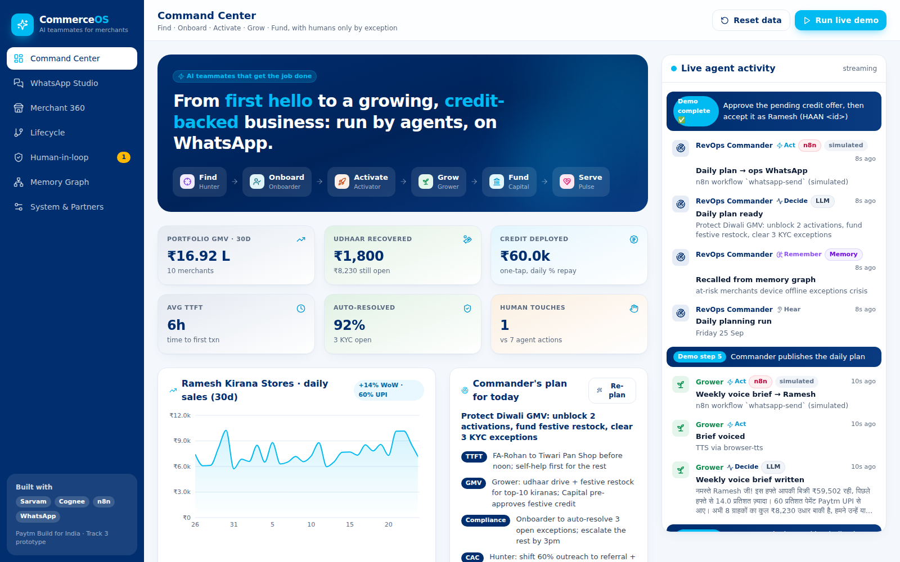
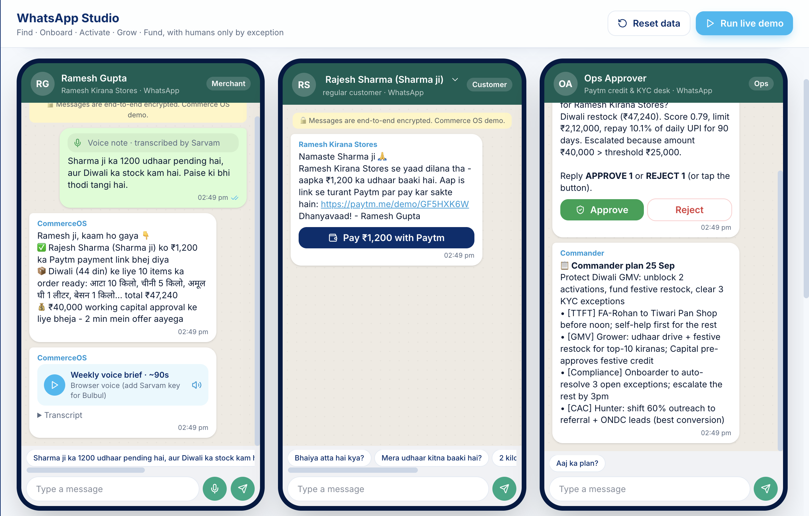
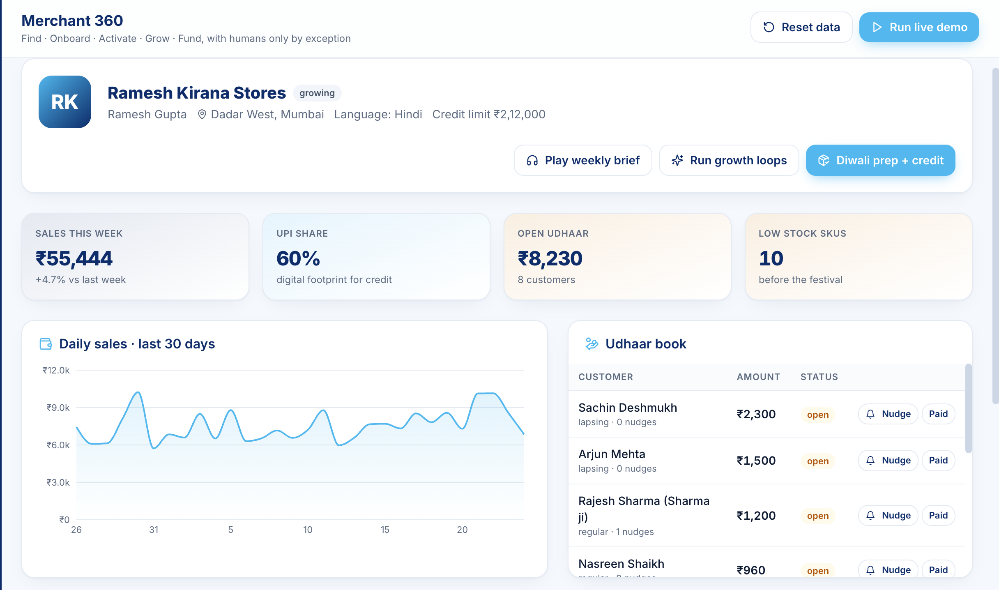
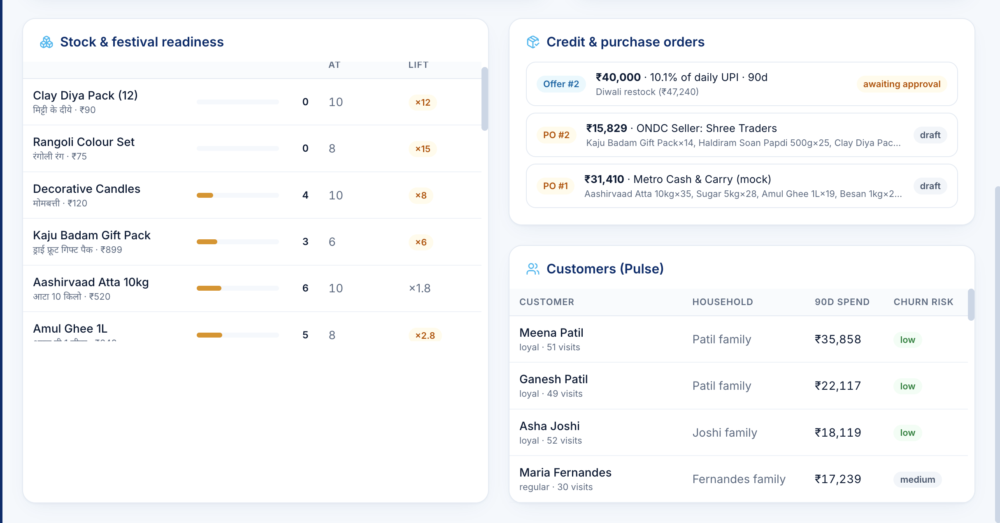
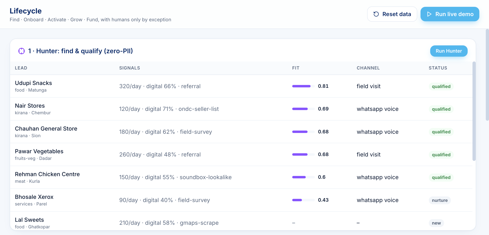
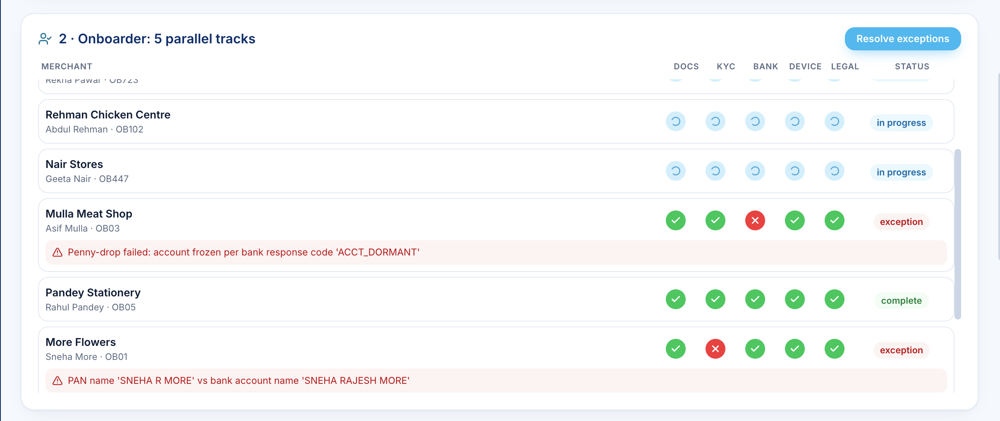
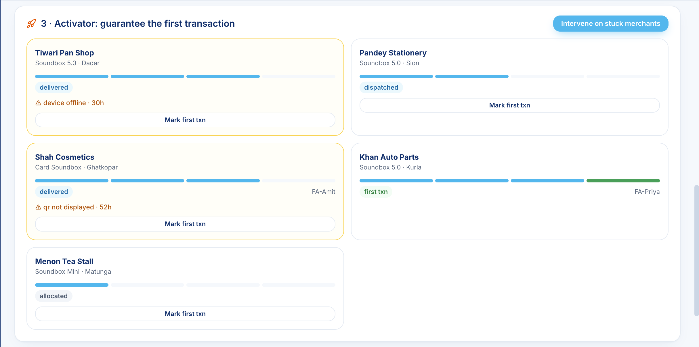
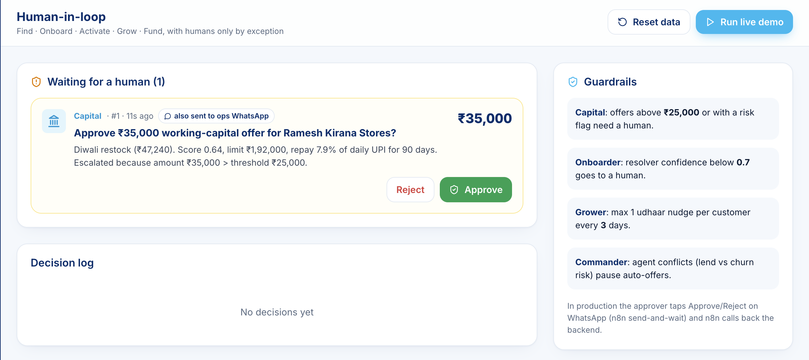
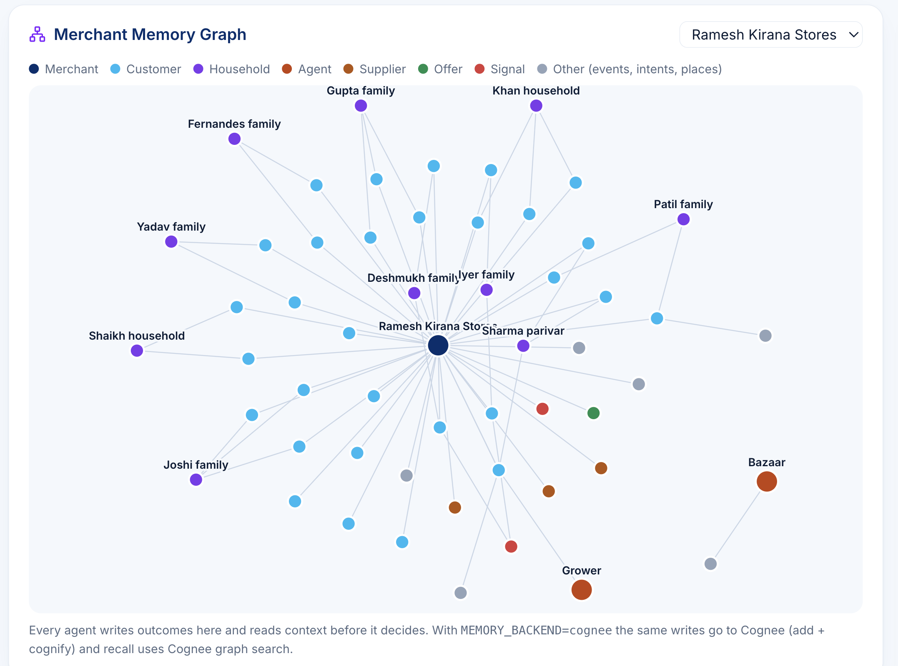
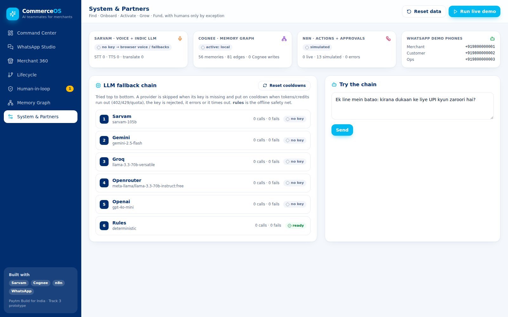

# Paytm Commerce OS: AI teammates that get the job done

Hackathon prototype for **Paytm Build for India, Track 3**. A team of AI agents takes a small merchant from lead to a growing, credit-backed business. They talk on **WhatsApp**, in the merchant's language, and act across systems. Humans step in only by exception.

**Partner stack:** **Sarvam** (Indic LLM, STT, TTS, translation) · **Cognee** (Merchant Memory Graph) · **n8n** (actions and human-in-the-loop on WhatsApp)

> Background: `CommerceOS.md` (single source of truth) · `workflow.md` (plain-language walkthrough for the deck)

---

## Quick start (about 3 minutes, no API keys needed)

Prereqs: [uv](https://docs.astral.sh/uv/), Node 20+.

```bash
cp .env.example .env            # optional; everything falls back without keys

# 1) backend
cd backend
uv sync
uv run uvicorn app.main:app --reload --port 8000

# 2) frontend (new terminal)
cd frontend
npm install
npm run dev                     # http://localhost:5173
```

Click **Run live demo**, then open **WhatsApp Studio**.

Single-port option: `cd frontend && npm run build`, then just open http://localhost:8000 (FastAPI serves the built UI).

Without keys, everything still runs:

| Missing | Fallback |
|---|---|
| All LLM keys | Deterministic "rules" provider |
| Sarvam key | Browser speech for the voice brief, plus a built-in demo transcript for voice notes |
| n8n | Actions are **simulated** and shown in the in-app WhatsApp simulator |
| Cognee | Built-in SQLite graph memory |

Add keys to make each part live.

---

## The hero demo (what judges see)

1. **Ramesh** (kirana owner) sends a Hindi voice note: *"Sharma ji ka 1200 udhaar pending hai, aur Diwali ka stock kam hai…"*
2. **Sarvam STT** transcribes it, and the **Router** (LLM) extracts 2 intents.
3. **Grower** recalls Sharma ji from **Cognee**, drafts a polite Hinglish nudge, and **n8n** sends a Paytm Collect link on WhatsApp.
4. **Grower → Bazaar** forecasts Diwali demand, gets quotes from 3 suppliers and drafts POs. This surfaces a **liquidity gap**.
5. **Capital** underwrites from the ledger and proposes about ₹40k. That is above the ₹25k guardrail, so it **escalates to a human** (WhatsApp send-and-wait in n8n / Approvals page).
6. Ops taps **Approve**, and Ramesh gets a one-tap offer. When he taps **Accept**, the funds are disbursed and **Bazaar places the POs**.
7. **Pulse** answers a customer's *"atta hai kya?"* and recovers a failed UPI payment in milliseconds.
8. **Grower** sends the weekly **Hindi voice brief** (Sarvam Bulbul TTS).
9. **Commander** publishes the daily plan to ops.

Every step streams live into the activity feed, following the 6-step loop: Hear → Understand → Remember → Decide → Act → Learn.

---

## Screenshots

### Command Center
KPIs across the portfolio, the Commander's daily plan, quick actions for each agent and the live activity feed.



### WhatsApp Studio
Three phones side by side: the merchant (Ramesh), a customer (Sharma ji) and the ops approver. Shows the voice note, payment link, credit approval and weekly voice brief in one flow.



### Merchant 360
Ramesh Kirana Stores: weekly sales, UPI share, open udhaar, low-stock items, the daily sales chart and the udhaar book with Nudge / Paid actions.



Further down: festival stock readiness, credit offers, purchase orders drafted by Bazaar, and customers with household and churn risk (Pulse).



### Lifecycle
**Hunter**: leads scored on non-personal signals only, with the chosen outreach channel.



**Onboarder**: 5 parallel KYC tracks per merchant. Exceptions are auto-resolved or escalated to a human.



**Activator**: device-to-first-transaction progress, stuck-device alerts and field agent assignment.



### Human-in-the-loop
Approvals raised when a guardrail fires, e.g. a credit offer above ₹25,000. The same request goes to the ops approver on WhatsApp.



### Memory Graph
The shared Merchant Memory Graph: merchant, customers, households, agents, suppliers, offers and signals.



### System & Partners
Status of Sarvam, Cognee, n8n and WhatsApp, plus the live LLM fallback chain and a "Try the chain" box.



---

## Architecture

```
WhatsApp ─▶ n8n WF1 (inbound) ─▶ FastAPI router ─▶ agents ─┬─▶ Sarvam (LLM / STT / TTS / translate)
                                                            ├─▶ Cognee memory graph  +  SQLite ledger
React dashboard ◀── SSE /api/events ◀───────────────────────┤
                                                            └─▶ n8n WF2–WF7 ─▶ WhatsApp / Paytm rails (mock)
                                                                     └─ send-and-wait approval ─▶ /api/callbacks/n8n
```

```
commerceos/
├── backend/                 FastAPI + uv
│   └── app/
│       ├── main.py          API routes, SSE, demo orchestrator
│       ├── llm.py           LLM gateway with fallback chain
│       ├── db.py, seed.py   SQLite ledger + synthetic data
│       ├── agents/          commander, hunter, onboarder, activator, grower, bazaar, capital, pulse, router, approvals
│       └── services/        sarvam.py, memory.py (Cognee), n8n.py, rails.py (mock Paytm)
├── frontend/                React + Vite + Tailwind v4 (Paytm navy/sky theme)
├── n8n/workflows/           WF1–WF7 importable JSON
├── demo/                    optional voice sample + cached TTS audio
├── docker-compose.yml       n8n
└── .env.example
```

---

## LLM fallback chain

Set in `LLM_PROVIDER_ORDER` (default `sarvam,gemini,groq,openrouter,openai,rules`).

- A provider with an empty key is skipped.
- On **402/429/quota/credit** errors the provider goes on **cooldown** (`LLM_COOLDOWN_S`), and the next one answers.
- On **401/403** the provider is disabled for the session. On **5xx/timeouts** it gets a short cooldown.
- `rules` is the offline safety net, so a demo never fails.
- Live status is on **System & Partners**, which also has "Try the chain" and "Reset cooldowns".
- Test: `cd backend && uv run --group dev pytest -q`

---

## Going live with partners

### Sarvam
Add `SARVAM_API_KEY` from [dashboard.sarvam.ai](https://dashboard.sarvam.ai) (₹100 free credits per account). This powers:

- the chat LLM (`sarvam-105b`)
- STT (`saaras:v3`)
- TTS (`bulbul:v3`, speaker `shubh`)
- translation

TTS audio is cached in `demo/audio/`, so replays are free.

### Cognee
```bash
cd backend && uv sync --extra memory
# .env
MEMORY_BACKEND=cognee
COGNEE_LLM_API_KEY=...        # Cognee needs its own LLM + embedding provider (see .env.example)
```
Writes go to Cognee (`add` + batched `cognify`), and recall uses `GRAPH_COMPLETION` search. The local graph keeps running too, so the UI can draw it and the app survives Cognee errors.

### n8n + WhatsApp
1. Start n8n with `docker compose up -d` (http://localhost:5678), or use n8n Cloud.
2. For the WhatsApp Trigger, n8n needs a public HTTPS URL. Use `ngrok http 5678` and set `N8N_PUBLIC_URL`.
3. In Meta for Developers, create an app, add WhatsApp and copy the test number's **Phone number ID** and **access token**. Add your demo phones as **recipients** (the free test number can message about 5 verified numbers).
4. In n8n, create these credentials:
   - **WhatsApp account** (API): access token + business account ID
   - **WhatsApp OAuth account** (trigger): app ID + secret
   - **CommerceOS secret** (Header Auth): name `X-CommerceOS-Secret`, value = `N8N_WEBHOOK_SECRET`
5. Import `n8n/workflows/WF1…WF7`. Open each WhatsApp node, pick the credential and phone number (replace `REPLACE_WITH_PHONE_NUMBER_ID`), and set `backend_url` and `secret` in the **Config** nodes. If n8n runs in Docker, `backend_url` is `http://host.docker.internal:8000`.
6. Activate the workflows. Then set in `.env`:
   - `N8N_BASE_URL=http://localhost:5678`
   - `PUBLIC_BACKEND_URL=<ngrok URL of :8000>` (needed so WhatsApp can fetch the voice-brief audio)
   - `DEMO_*_PHONE` = your real test numbers
7. Before presenting, have every demo phone send "hi" to the bot to open WhatsApp's **24-hour window**. Outside that window only approved templates can be sent.

| WF | Webhook | Purpose |
|---|---|---|
| WF1 | WhatsApp Trigger | Inbound text, voice notes and button replies → backend |
| WF2 | `/webhook/udhaar-nudge` | Payment reminder with Collect link |
| WF3 | `/webhook/capital-offer` | Credit approval, send-and-wait → callback |
| WF4 | `/webhook/onboarding-escalation` | KYC exception → human → callback |
| WF5 | cron 08:47 IST | Commander daily plan |
| WF6 | `/webhook/bazaar-po` | PO to supplier |
| WF7 | `/webhook/whatsapp-send` | Generic outbound (text / audio) |

> The workflow JSONs target n8n 1.x node versions. After import, n8n may ask you to re-select credentials or update node versions. That's expected.

---

## Guardrails (tunable in `.env`)

| Rule | Default |
|---|---|
| Capital offer needs human approval | Above ₹25,000 or merchant risk flag |
| Onboarding exception escalates | Resolver confidence below 0.7 |
| Udhaar nudge cap | 1 per customer per 3 days |

## Useful endpoints
`GET /api/health` · `GET /api/events` (SSE) · `POST /api/demo/run` · `POST /api/demo/reset` · `POST /api/ingest/text` · `POST /api/ingest/voice` · `POST /api/ingest/whatsapp` · `POST /api/callbacks/n8n` · interactive docs at `http://localhost:8000/docs`

## Mocked in the prototype (roadmap)
- **Paytm rails:** Collect, disbursal, Soundbox and settlements are mocked.
- **Bandits and causal inference:** replaced with transparent rules and scorecards.
- **Supplier allocation:** a greedy effective-cost choice stands in for MILP.
- **Not built yet:** MARL, federated learning and on-device models.
- **All data is synthetic.**
