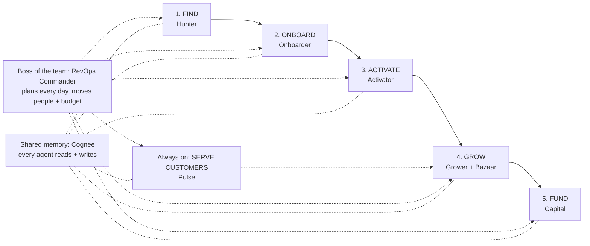

# Paytm Commerce OS: How It Works (End-to-End Workflow)

> **What this file is:** A plain-language walkthrough of the whole product, written for building the submission deck. For technical detail (architecture, APIs, data model), see `CommerceOS.md`.

---

## 1. The one-line pitch

**Commerce OS is a team of AI teammates that takes a small Indian merchant from "never heard of Paytm" to a growing, credit-backed business. It talks in the merchant's language, remembers everything, and actually gets work done, calling a human only when it truly needs one.**

Track 3 fit: the agents don't just answer questions. They **decide, act across systems, and escalate only by exception**.

---

## 2. The problem in plain words

- Getting a kirana onto Paytm is slow, manual and leaky. Merchants drop off halfway.
- Even after they get a Soundbox, many never make a first transaction.
- Merchants run on gut feel: udhaar goes unpaid, stock runs out before festivals, cash runs short, and loans arrive too late.
- They don't know who their repeat customers are, or when a customer is slipping away.
- They speak many languages, and connectivity is patchy.

---

## 3. The big picture: 5 stages + 1 always-on helper

| Stage | AI teammate | In one sentence |
|---|---|---|
| Plan | **RevOps Commander** | The team lead. Every morning it decides where field agents, devices and budget should go. |
| 1. Find | **Hunter** | Finds shops worth signing up, scores them, and reaches out on the right channel at the right time. |
| 2. Onboard | **Onboarder** | Runs documents, KYC, bank, device and legal checks all at once and fixes most problems itself. |
| 3. Activate | **Activator** | Ships the Soundbox, sends help if needed, and doesn't stop until the first real payment happens. |
| 4. Grow | **Grower** (with **Bazaar** inside) | The merchant's business partner: collects udhaar, wins back customers, preps for festivals, restocks smartly, and sends a weekly voice brief. |
| 5. Fund | **Capital** | Spots a cash crunch before the merchant asks and offers a one-tap loan that's repaid as a small slice of daily sales. |
| Always on | **Pulse** | The invisible salesperson: recognises customers, answers their questions, recovers failed payments, and sends the right offer to each one. |

---

## 4. How every AI teammate works: the 6-step loop

Every agent, for every task, follows the same loop. This is the core slide.

| Step | What happens | Powered by |
|---|---|---|
| 1. **Hear** | A message, voice note, click or daily timer kicks things off | WhatsApp via **n8n** |
| 2. **Understand** | The voice is turned into text and the AI works out what's needed, in any Indian language | **Sarvam** speech-to-text + Indic LLM |
| 3. **Remember** | The agent pulls everything relevant: the customer's history, their household, past decisions | **Cognee** memory graph |
| 4. **Decide** | Rules + AI pick the best action and check safety limits | Agent logic + guardrails |
| 5. **Act** | The action actually happens: a payment link is sent, a loan is offered, an order is raised. If a limit is crossed, a human approves first. | **n8n** workflows (+ Paytm rails) |
| 6. **Learn** | The outcome is saved so the next decision is smarter, for this merchant and all others | **Cognee** + learning engine |

---

## 5. Stage-by-stage workflow

### Stage 0: Daily plan (RevOps Commander)
1. Every morning, n8n wakes the Commander.
2. It reads how every merchant and agent is doing from shared memory.
3. It balances four goals: more sales (GMV), lower acquisition cost (CAC), faster first transaction (TTFT) and staying compliant.
4. It sends out the day's plan: which areas get field agents, where devices go, and how much budget each agent gets.
5. If something breaks (for example a spike in KYC failures), it issues crisis orders.
- **Human role:** only for big strategic calls.

### Stage 1: Find (Hunter)
1. Collects leads.
2. Profiles each shop **without using personal data**.
3. Scores how likely the shop is to join and stay active.
4. Chooses the best way to reach out (channel, message, time) and learns from who responds.
5. Hands a qualified lead to Onboarder with a full context packet, so nobody asks the merchant the same thing twice.
- **Outcome:** only good leads move forward.

### Stage 2: Onboard (Onboarder)
1. Runs **5 tracks in parallel**: documents, compliance/KYC, bank account, device, and legal.
2. When something goes wrong (a name mismatch, a blurry document), the AI fixes it itself. **About 92% of problems get fixed automatically.**
3. The rest go to a human, with everything already assembled. The human just decides; n8n pauses the flow and resumes once they click approve.
- **Outcome:** faster sign-up, fewer drop-offs.

### Stage 3: Activate (Activator)
1. Picks a device from inventory and ships it.
2. Assigns a field agent only where it's worth the cost.
3. Watches for stuck merchants (device off, QR not displayed) and steps in right away.
4. **Guarantees a first real transaction**, not just a delivered box.
- **Outcome:** merchants who actually start using Paytm.

### Stage 4: Grow (Grower + Bazaar)
Grower runs these loops for the merchant, continuously:
1. **Udhaar recovery:** polite nudges in the customer's language, with a Paytm Collect link so they can pay instantly.
2. **Customer win-back:** spots regulars who've stopped coming and brings them back.
3. **Festival and peak-hour prep:** gets stock and staff ready before Diwali or the evening rush.
4. **Loyalty and referrals:** turns happy customers into new ones.
5. **Weekly voice brief:** a 90-second summary in the merchant's own language covering what happened and what to do next.

Bazaar (inside Grower) handles restocking:
1. Predicts what the shop will need.
2. Asks several suppliers at once for price, credit terms and delivery time.
3. Picks the best mix, raises the order automatically, and pays once the goods arrive and the bill matches.
- **Outcome:** more sales, less money stuck with customers, no stock-outs.

### Stage 5: Fund (Capital)
1. Checks the merchant's creditworthiness **continuously** from their sales, instead of making them apply.
2. When Grower spots a cash gap, Capital **offers a loan before the merchant asks**.
3. The merchant accepts with **one tap** and the money arrives instantly.
4. Repayment is a **small % of daily sales**, so it's lighter on slow days.
5. Good repayment raises the limit automatically, and insurance is offered later.
6. Offers above a set limit, or for merchants with risk flags, go to a human for approval first.
- **Outcome:** credit at the exact moment it's needed.

### Always on: Serve customers (Pulse)
1. Recognises the same customer across UPI, device and behaviour, and groups families into households.
2. Picks the best action for each customer: cashback, loyalty, win-back, cross-sell, referral, feedback, or payment recovery.
3. Recovers failed payments in seconds.
4. Answers customer questions in their language: "Is atta in stock?", "What's my udhaar?", pre-orders, bookings, complaints.
5. Feeds what it learns about customers back to Grower through shared memory.
- **Outcome:** repeat business without the merchant lifting a finger.

---

## 6. When does a human step in?

Autonomy first; humans by exception. In the prototype, n8n pauses the flow and pings a human on WhatsApp only when:

| Situation | Who gets pinged |
|---|---|
| The Onboarder can't fix a document or KYC problem with confidence | Ops reviewer |
| A loan offer is above the limit (₹25,000 default) or the merchant has a risk flag | Credit approver |
| Two agents disagree (e.g. Capital wants to lend but Grower sees churn risk) | Commander flags it for a human |
| A strategic decision (budget shifts, crisis response) | Business lead |

Everything else runs on its own.

---

## 7. The demo story: "A day with Ramesh's kirana"

This is the live flow for the judges. Each step shows which partner tech is working.

| # | What happens | Agent | Partner tech |
|---|---|---|---|
| 1 | Ramesh sends a Hindi voice note: "Sharma ji ka 1200 udhaar pending hai, aur Diwali ka stock kam hai." | — | WhatsApp via **n8n** |
| 2 | The voice becomes text and the AI finds two jobs: collect ₹1,200 from Sharma ji, and a Diwali stock/cash worry | Router | **Sarvam** STT + LLM |
| 3 | The agent looks up Sharma ji: a regular who pays late but does pay, and part of a household that shops together | Grower | **Cognee** |
| 4 | Sharma ji gets a polite Hindi message with a payment link | Grower | **n8n** + **Sarvam** translate |
| 5 | The AI sees a cash gap before Diwali and prepares a loan offer from 90 days of sales | Capital | **Cognee** + ledger |
| 6 | The offer is above the limit, so an ops person gets an "Approve?" button on WhatsApp and taps yes | Capital | **n8n** approval |
| 7 | Ramesh gets a one-tap loan offer | Capital | **n8n** |
| 8 | A customer asks the bot "atta hai kya?" and gets an instant answer | Pulse | **Sarvam** + **Cognee** |
| 9 | Ramesh hears his weekly brief in Hindi | Grower | **Sarvam** TTS |
| 10 | The dashboard shows every decision, action and memory update live, and the Commander's KPIs move | Commander | Dashboard |

---

## 8. Where the partners fit (one slide)

| Partner | Job in Commerce OS | In one line |
|---|---|---|
| **Sarvam** | The **voice and language** of the team | Understands and speaks the merchant's language: speech-to-text, text-to-speech, translation, Indic LLM |
| **Cognee** | The **memory** of the team | One shared memory graph of merchants, customers, households and decisions that every agent reads and writes |
| **n8n** | The **hands** of the team | Turns decisions into real actions (payment links, offers, orders) and brings in a human for approval when needed |

---

## 9. Why it's different

- **Does the job, end-to-end:** from finding the merchant to funding them, with actions, not just chat.
- **One shared memory:** what Pulse learns about customers helps Grower, and what Grower sees triggers Capital.
- **Speaks Bharat:** voice-first, in the merchant's own language.
- **Privacy by design:** no personal data in lead scoring, and learning without PII leaving the device *(production design)*.
- **Humans only by exception:** guardrails decide when to call a person.
- **Built on Paytm rails:** Soundbox, Collect, Settlements, UPI, ONDC.

---

## 10. What to measure (impact slide)

| Metric | Agent that moves it |
|---|---|
| Lead-to-onboard conversion, CAC | Hunter, Onboarder |
| % exceptions auto-resolved (target about 92%) | Onboarder |
| Time to first transaction (TTFT) | Activator |
| Udhaar recovered, repeat-customer rate, GMV | Grower, Pulse |
| Credit offered at the right time, repayment rate | Capital |
| Human touches per merchant | All (should trend down) |

---

## 11. Suggested deck outline

1. Title + one-line pitch
2. The problem (section 2)
3. Meet the AI team (section 3 table)
4. How every teammate works: the 6-step loop (section 4)
5. The merchant journey, stage by stage (section 5, one visual)
6. Humans by exception (section 6)
7. Partner stack: Sarvam, Cognee, n8n (section 8)
8. Architecture (diagram from `CommerceOS.md` 8.2)
9. Live demo: Ramesh's kirana (section 7)
10. Impact + what we'd measure (section 10)
11. Roadmap: bandits, causal inference, multi-agent RL, federated learning, on-device models, real Paytm rails, WhatsApp Business verification for production scale
12. Team + thank you
